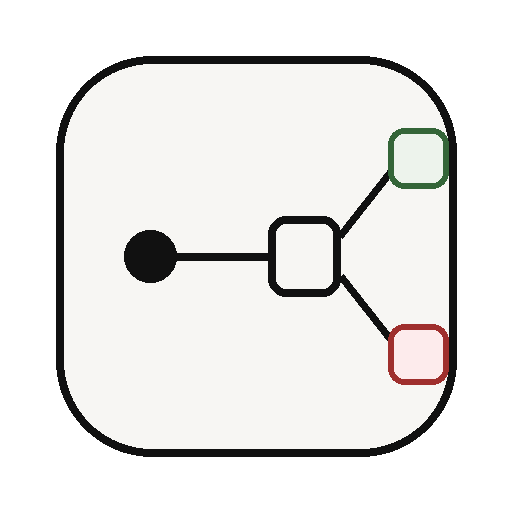
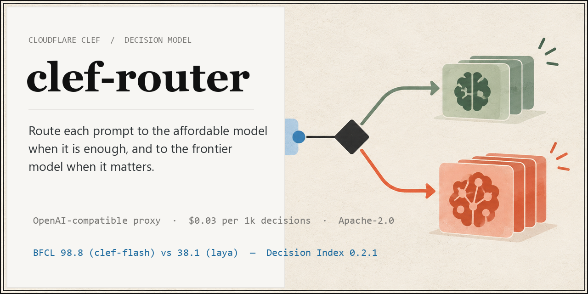
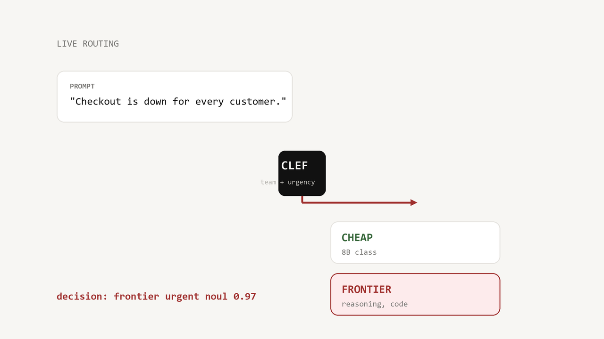
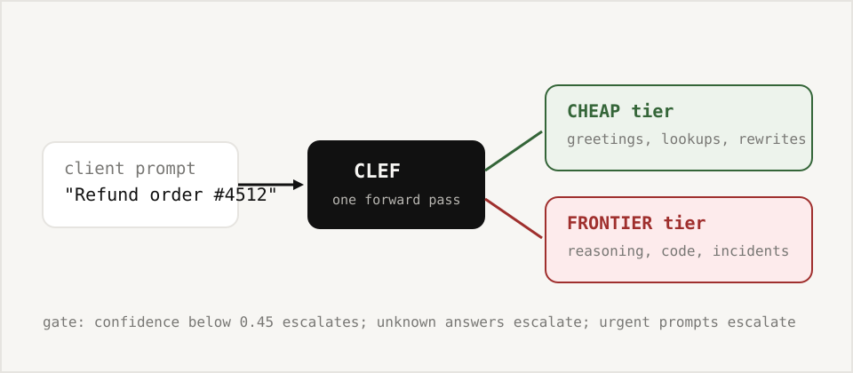

<p align="center">
  
</p>

<h1 align="center">clef-router</h1>

<p align="center">
  
</p>

<p align="center">
  <strong>Route prompts with Cloudflare's Clef decision model.</strong><br>
  Send each prompt to the affordable model when it is enough, and to the frontier model when it matters.
</p>

<p align="center">
  <a href="https://github.com/Gjusev/clef-router/actions/workflows/test.yml"></a>
  <a href="https://pypi.org/project/clef-router/"></a>
  <a href="pyproject.toml"></a>
  <a href="LICENSE"></a>
  <a href="https://www.kaggle.com/code/gjusev/clef-router-evals"></a>
  <a href="https://www.kaggle.com/code/gjusev/clef-router-gpu-evals"></a>
</p>

<p align="center">
  <a href="#demo"><strong>Demo</strong></a> &middot;
  <a href="#quickstart"><strong>Get started</strong></a> ·
  <a href="#how-it-works"><strong>How it works</strong></a> ·
  <a href="#benchmarks"><strong>Benchmarks</strong></a> ·
  <a href="#reproduce-on-kaggle"><strong>Kaggle</strong></a> ·
  <a href="#clef-vs-laya"><strong>clef vs laya</strong></a> ·
  <a href="#limitations"><strong>Limitations</strong></a>
</p>

---

## Demo

<p align="center">
  <a href="brag-output/brag.mp4" title="Watch the 12-second clef-router demo">
    
  </a><br />
  <sub><strong>▶ <a href="brag-output/brag.mp4">Watch the 12-second product demo</a></strong> &mdash; routing decisions, policy safeguards, and measured results.</sub>
</p>

GitHub READMEs do not reliably render repository MP4s with native controls, so
the video is presented as a clickable poster frame; it opens the generated
[`brag.mp4`](brag-output/brag.mp4) directly.

### At a glance

| | |
| --- | --- |
| **Purpose** | Choose an affordable or frontier completion tier before your app calls the model. |
| **Interface** | OpenAI-compatible proxy, Python client, async client, and CLI. |
| **Decision model** | [Cloudflare Clef](https://huggingface.co/Cloudflare/clef), using one joint forward pass. |
| **Safety policy** | Low confidence, urgent prompts, unknown answers, and parse failures escalate to frontier. |
| **Evidence** | Committed fixtures, reproducible local evaluation, and public Kaggle CPU/T4 runs. |

## Quickstart

```bash
pip install clef-router
export CLEF_ACCOUNT_ID=your_cloudflare_account_id
export CLEF_API_TOKEN=your_cloudflare_api_token
```

Run it as a proxy and point any OpenAI client at it:

```bash
clef-router --port 8000
```

```python
from openai import OpenAI

client = OpenAI(base_url="http://127.0.0.1:8000/v1", api_key="not-needed")

completion = client.chat.completions.create(
    model="auto",  # the router chooses; your value is ignored
    messages=[{"role": "user", "content": "Say hi in three words"}],
)
print(completion.choices[0].message.content)  # the routing decision as JSON
print(completion.extensions["clef"]["tier"])  # "cheap" or "frontier"
```

The proxy is a decision service. It returns the routing decision (tier, confidence, reason, token usage) in an OpenAI-shaped response, and your client calls the chosen model, exactly like laya-router's decision headers.

Prefer in-process? The library and the CLI do the same thing without HTTP:

```python
from clef_router import ClefRouter

with ClefRouter() as router:
    routing = router.route("Design a rate limiter")
print(routing.tier)            # "frontier"
print(routing.reason)          # "team selected frontier"
print(routing.decision.usage.input_tokens)
```

```bash
clef-route "Design a rate limiter"
# tier:       frontier
# reason:     team selected frontier
# model:      clef-flash
```

Async clients, custom question sets, and raw decisions are one import away:

```python
from clef_router import AsyncClefRouter

async with AsyncClefRouter() as router:
    decision = await router.decide({"invoice_total": 1250, "due_days": 45})
```

## How it works

<p align="center">
  <a href="docs/how-it-works.html">
    
  </a><br />
  <sub>Static architecture overview. <a href="docs/how-it-works.html">Open the animated explainer</a>.</sub>
</p>

```
   your app (OpenAI SDK)          your app (library / CLI)
          |                               |
          v                               v
   +---------------------+      +----------------+
   | clef-router proxy   |      | clef_router    |
   | POST /v1/chat/...   |      | ClefRouter     |
   | POST /v1/decide     |      |                |
   +----------+----------+      +-------+--------+
              |                          |
              +------------+-------------+
                           v
        +--------------------------------------+
        |  Clef decision model  (one call)     |
        |  questions: team, urgency            |
        |  answers:   probabilities per option |
        +------------------+-------------------+
                           |
        team=cheap & conf>=0.45 --> CHEAP tier
        otherwise (low confidence, urgent,
        unknown answer)----------> FRONTIER tier
```

One forward pass scores every option of every question, so a decision costs a
single small request. The policy is fail-safe on purpose:

1. When the `team` answer names a tier, that tier wins, unless its confidence
   is below `min_confidence` (default 0.45), which escalates to frontier.
2. With no usable `team` answer, the `urgency` probability routes: 0.5 or
   higher goes frontier.
3. Anything the router cannot parse escalates. It never silently picks the
   cheap tier without evidence.

<details>
<summary>Animated explainer</summary>
<p>Open <a href="docs/how-it-works.html">docs/how-it-works.html</a> in a
browser. Static version: <a href="docs/how-it-works.svg">docs/how-it-works.svg</a>.</p>
</details>

## Benchmarks

Two different things get measured, and mixing them up is the oldest trick in
routing marketing. We keep them separate.

**What we measured** (this repo, `evals/run_eval.py`, committed results):

| Metric | Result | What it is |
| --- | --- | --- |
| Policy accuracy | **100%** (n=42) | Does the tier policy map labeled decisions to the right tier. Fixtures committed in `evals/data/`. |
| Escalation precision | **1.00** | Of the frontier escalations, how many were justified. 0 over-escalations, 0 under-routes. |
| Decision overhead (library) | **p50 0.12 ms / p95 0.26 ms / p99 0.47 ms** | Client-side cost of parsing and policy. Excludes the network call. |
| Cost per 1k decisions | **$0.078 measured** ($0.033 estimated from fixtures) | Real mean is 324 input tokens per decision at Cloudflare's published $0.24 per million input tokens. The fixture estimate undershot; the GPU rerun below measured the real token counts. |
| Kaggle rerun (Linux, clean box) | **accuracy 1.00, p50 0.34 ms** | Same dataset and code, executed by the public kernel `gjusev/clef-router-evals`; log and JSON committed in `evals/results/`. |
| **Real model, local weights** (Kaggle T4) | **accuracy 92.9% (39/42), warm p50 506 ms** | `clef-flash` weights in 4-bit on one T4, same prompts and policy, no Cloudflare API. The 3 misses: two genuinely ambiguous prompts routed cheap ("write a sonnet", "what about the other approach") and one safe over-escalation of a Python question. Full trace in `evals/results/routing-gpu-eval.json`. |

**What Cloudflare measured** (Decision Index 0.2.1, from the
[model card](https://huggingface.co/Cloudflare/clef); that suite scores the
decision model itself, not this router):

| Benchmark | Clef | Clef-flash | Laya |
| --- | --- | --- | --- |
| BFCL (accuracy) | 98.5 | **98.8** | 38.1 |
| MMLU (accuracy) | 90.3 | **91.8** | 30.7 |
| Median latency (ms) | 209.3 | 38.8 | **5.8** |
| p95 latency (ms) | 238.6 | **122.4** | 222.5 |

Reproduce our numbers offline (no credentials, seconds to run):

```bash
python evals/run_eval.py                          # writes evals/results/routing-eval-mock.json
python evals/run_eval.py --mode api               # real end-to-end numbers; needs credentials
```

The repository ships a regression gate so a routing change cannot silently
drop accuracy:

```yaml
- uses: ./.github/actions/regression-gate
  with:
    current: evals/results/current.json
    baseline: evals/results/baselines/routing-eval-mock.json
    metrics: |
      metrics.accuracy:max
      metrics.escalations.escalation_precision:max:0.05
```

## clef vs laya

| | [laya-router](https://github.com/Gjusev/laya-router) | clef-router |
| --- | --- | --- |
| Decision quality (BFCL) | 38.1 | **98.8** (clef-flash) |
| Median decision latency | **5.8 ms** | 38.8 ms (hosted flash) / 209.3 ms (full) |
| Decision overhead (local library) | n/a, proxy-local | **0.12 ms** |
| Hosting | local CPU | Cloudflare Workers AI |
| Routing cost | $0 | ~$0.03 per 1k decisions |
| Context | 32k | 64k tokens |
| Answer production | proxy swaps the model upstream | returns the decision; you call the model |

Honest reading: laya wins on latency because it runs on your machine.
clef-router wins on decision quality, which shows up as fewer wrong routes on
genuinely hard prompts. If your workload is latency-sensitive at the routing
step and mostly easy prompts, laya is a great fit. If misroutes cost more
than 30 ms, use clef-router.

## Context compaction

`clef_router.compactor` uses the same one-pass trick for RAG: one Clef
request scores the relevance of up to 64 retrieved documents, then a token
budget decides what survives. Documents are kept verbatim or cut with a
reason; nothing is rewritten.

```python
from clef_router.compactor import compact

result = compact(
    "invoice processing rules",
    documents=retrieved_chunks,
    budget=2048,
)
print(result.stats.savings_pct)   # e.g. 61.3
print(result.kept[0].score)       # 0..3 relevance
print(result.cut[2].reason)       # "score 0 below min_score 1"
```

Framework adapters ship as extras (`pip install "clef-router[compactor]"`):

```python
from clef_router.compactor.langchain import ClefDocumentCompressor   # LangChain
from clef_router.compactor.llamaindex import ClefNodePostprocessor   # LlamaIndex
```

## Configuration

Environment variables, with `CLEF_*` winning over `CLOUDFLARE_*` fallbacks:

| Variable | Default | Purpose |
| --- | --- | --- |
| `CLEF_ACCOUNT_ID` | (required) | Cloudflare account. Falls back to `CLOUDFLARE_ACCOUNT_ID`. |
| `CLEF_API_TOKEN` | (required) | API token with Workers AI permissions. Falls back to `CLOUDFLARE_API_TOKEN`. |
| `CLEF_MODEL` | `clef-flash` | `clef` or `clef-flash`. |
| `CLEF_MIN_CONFIDENCE` style options | `0.45` | Set `min_confidence` in code; `0` disables the gate. |
| `CLEF_TIMEOUT` | `30` | Per-request timeout in seconds. |
| `CLEF_MAX_RETRIES` | `2` | Retry attempts for timeouts, network errors, 429 and transient 5xx, with exponential backoff and jitter; honors `Retry-After`. |
| `CLEF_LOG_LEVEL` | `INFO` | Standard Python level names. |
| `CLEF_HOST` / `CLEF_PORT` | `127.0.0.1:8000` | Proxy bind address. |

Retries are structured: timeouts and connection errors retry, HTTP 401/403
raise `ClefAuthError` immediately, 429 raises `ClefRateLimitError` with the
server's `Retry-After` once the budget is spent. Every HTTP-derived error
carries the status code, the Cloudflare error code, and the `cf-ray` request
id when present.

## Operate the proxy

```bash
docker build -t clef-router .
docker run -p 8000:8000 -e CLEF_ACCOUNT_ID=... -e CLEF_API_TOKEN=... clef-router
```

- `"stream": true` works: the decision arrives as OpenAI-shaped SSE chunks
  (role, decision JSON, stop, `[DONE]`), and the `clef` extension rides in
  the first chunk.
- `GET /metrics` serves Prometheus text: `clef_router_requests_total`
  by tier and status, plus a `clef_router_routing_seconds` histogram.
- `CLEF_DECISION_LOG=/path/decisions.jsonl` appends one JSON line per
  decision (tier, confidence, reason, latency, token usage, prompt
  preview) for post-hoc calibration of the confidence gate.

## Limitations

Stated plainly, because routing libraries that hide these waste your time.

- The proxy decides; it does not complete. It never forwards your prompt to a
  chat model. Clients that want the answer call the chosen model themselves.
- The committed policy number is accuracy on 42 labeled fixtures. The GPU
  rerun measures the real model on the same 42 prompts (92.9%), which is
  still a small set: neither number is a Decision-Index-grade benchmark. Use
  `--mode api` with real credentials to measure your own workload.
- The tier mapping reads the `team` and `urgency` question ids. Custom
  question sets work with `decide()`; `route()` still expects those ids.
- Latency depends on your network to Cloudflare. The 38.8 ms median is
  Cloudflare's measurement; add your round trip.
- Images are accepted by the API (`decide()`, max 4) but the routing
  question set is text-only today.
- Running `Cloudflare/clef-flash` weights locally is possible (Apache-2.0,
  9.4B) and is exactly what `evals/kaggle-kernel-gpu/` does on one T4 in
  4-bit; expect ~500 ms per decision there versus 38.8 ms median on
  Cloudflare's unquantized datacenter GPUs.

## Reproduce on Kaggle

Two public notebooks rerun the evaluation on Kaggle hardware. Open them
directly, fork them, or push the matching local kernel directory with the
Kaggle CLI:

- [**GPU (T4) notebook — `gjusev/clef-router-gpu-evals`**](https://www.kaggle.com/code/gjusev/clef-router-gpu-evals) (`evals/kaggle-kernel-gpu/`): downloads the real `clef-flash`
  weights, routes every labeled prompt through the model, and writes
  `routing-gpu-eval.json`. Needs a GPU-verified account; about 15 minutes
  and a slice of your 30 h weekly quota.
- [**CPU notebook — `gjusev/clef-router-evals`**](https://www.kaggle.com/code/gjusev/clef-router-evals) (`evals/kaggle-kernel/`): replays the committed fixtures through the
  policy pipeline in about two minutes, no GPU or credentials.

```bash
KAGGLE_API_TOKEN=... python -m kaggle kernels push -p evals/kaggle-kernel-gpu
```

## Development

```bash
git clone https://github.com/Gjusev/clef-router.git && cd clef-router
pip install -e ".[dev]"
make test          # offline suite, integration deselected
make lint          # ruff
make eval          # regenerate evals/results/routing-eval-mock.json
make assets        # regenerate logo, social card, diagrams, demo video
pytest -m integration   # live API tests; needs credentials
```

```
src/clef_router/     client (sync+async), config, errors, models, transport
src/clef_router/     server (FastAPI proxy), compat (in-process OpenAI)
src/clef_router/     compactor (core + LangChain/LlamaIndex adapters)
evals/               dataset, runner, committed results, Kaggle kernel
scripts/             asset generation, regression check CLI
tests/               offline suite; @pytest.mark.integration opts into the live API
```

## License

Apache-2.0. See [LICENSE](LICENSE). Clef is a Cloudflare model; its weights
carry the same license on the
[model page](https://huggingface.co/Cloudflare/clef).
